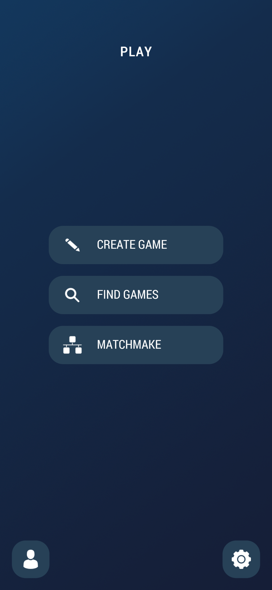

# Crypto Battle Royale UI Showcase

Welcome to the **Crypto Battle Royale UI Showcase**! This repository contains screenshots and examples of the user interface designs implemented in our Unity project using the legacy uGUI system. Feel free to browse through the different screens, see the design details, and learn how to integrate them into your own projects.

---

## 🎮 Project Overview

**Crypto Battle Royale** is a fast-paced, multiplayer card-based crypto trading simulation. Players draft and play resource cards representing different cryptocurrencies each round, aiming to maximize their end-of-game balance through strategic card use, market events, and timed auctions. This Unity project demonstrates:  
- **Modular UI Components** built with Unity’s legacy uGUI (Canvas, RectTransform, UI components).  
- **Responsive Layouts** using Anchors and Pivots to adapt to various resolutions.  
- **Animated Transitions** for card draws, market updates, and menu overlays via C# scripts and AnimationClips.  
- **Theming & Styling** with ScriptableObjects to define color palettes, fonts, and reusable UI settings.

---

## 🔄 UI Flow & Screenshots

### Main Menu  
  
_Entry point for starting games, viewing tutorials, or accessing settings._

### Game Type Selection  
  
_Choose between Quick Match, Ranked Match, or Custom Room._

### Loading / Matchmaking Screen  
  
_Searching for opponents and setting up the game environment._

### Waiting for Opponent  
  
_Paused screen showing opponent connection status and tips._

### Buy/Sell Phase  
  
_Place buy and sell orders for crypto-cards before the round begins._

### Round Card Drawn Phase  
  
_Draw phase where each player plays cards and market events resolve in turns._

### Profile Window  
  
_View player stats, rank, and achievements._

### Buy/Sell Window  
  
_Detailed interface for executing trades during the buy/sell phase._

### Charts Window  
  
_Live price charts, historical data, and market indicators._

---

## 🛠️ Built With

- [Unity Engine](https://unity.com/) – Game engine and editor  
- **uGUI** (Canvas, Image, Text, Button, Slider, Toggle, etc.) – Legacy UI framework  
- C# Scripts – Custom UI behaviors, animation controllers, and card-play logic  

---

> “In trading as in life, strategy and timing are everything.”  
